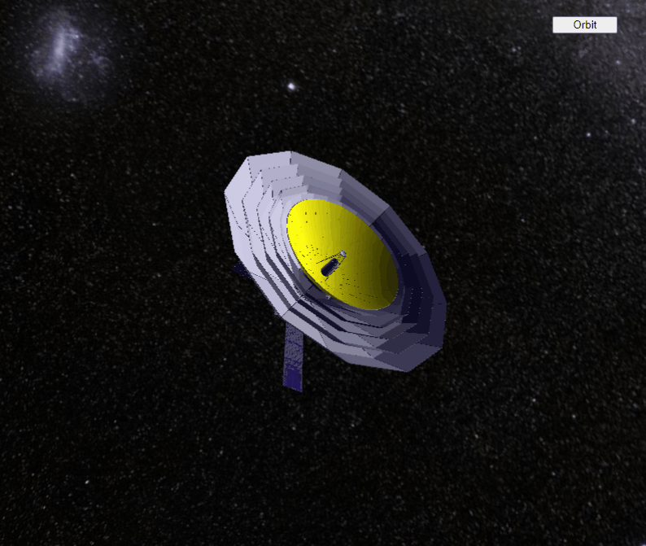

# 2015_WEB_3D_ThreeJS_Spacecraft_orbit_visualization
Визуализация орбиты космического телескопа Миллиметрон вокруг точки Лагранжа L2, java script, ThreeJS

Программа написана для просмотра в браузере, язык java script, отображение 3D графики реализовано через WebGL при помощи фреймворка ThreeJS

* Читать на других языках: [English](README.md), [Русский](README.ru.md)

Скриншот:

# Оглавление
- [Установка](#Установка)
- [Краткое описание](#Краткое-описание)
- [Попробовать в браузере](#Попробовать-в-браузере)

# Установка

Для использования достаточно скачать файл MM_orbit.zip, распаковать архив и залить на хостинг (при открытии html страницы локально работать - по крайней мере в Google Chrome - не будет из-за ограничения безопасности WebGL, т.к. ресурсы должны браться с одного домена)
Далее обращаться либо к странице webgl_orbit.html для просмотра орбиты либо к странице webgl_mm_model.html для просмотра модели космического радиотелескопа.

# Краткое описание

Данная визуализация демонстрирует работу космического телескопа Радиоастрон на орбите вокруг точки либрации L2 системы Земля-Солнце. Точка либрации L2 это точка неустойчивого равновесия, вокруг которой, тем не менее, возможны круговые орбиты.
Данная точка всегда находится в противоположном Солнцу направлении и совершает годичное движение вокруг Земли. Поэтому в системе координат связаной с Землей, орбита аппарата будет иметь сложную форму. В то же время, в системе отсчета 
вокруг точки либрации L2 орбита имеет привычный эллиптический вид. 

Кнопка Coord переключает систему координат между системами координат, в которых неподвижной считается либо Земля либо точка либрации L2.

Кнопка Labels включает или отключает отображение плоскостей эклиптики, небесного экватора и млечного пути.

Кнопка Spacecraft/Orbit переключает между режимами отображения орбиты и модели космического радиотелескопа.

Вращение сцены осуществляется либо движением мыши либо свайпами. Приближение/отдаление колесиком мыши либо свайпом.

# Попробовать в браузере

По ссылке ниже можно посмотреть на работу в браузере:

[Орбита](https://andrey-andrianov.github.io/sites/MM_orbit/webgl_orbit.html)

[Модель](https://andrey-andrianov.github.io/sites/MM_orbit/webgl_mm_model.html)

Для более удобного управления с мобильных устройств на экран добавлены наиболее часто используемые клавиши. Их можно скрыть или показать из панели управления DosBox слева. 
Также можно смотреть с мобильных устройств. В таком случае удобно добавить страницу на домашний экран устройства.
